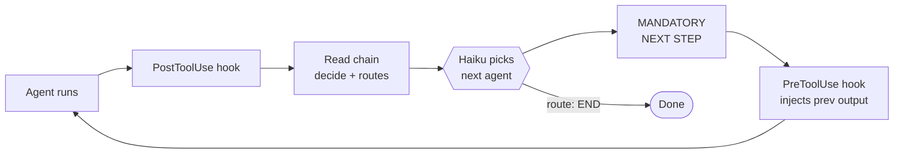

# brainbrew-devkit

**Self-correcting agent chains for Claude Code.**

A chain of agents takes turns. One plans, one codes, one reviews, one tests, one commits. If an agent fails, another agent fixes it and the chain retries — automatically.

You watch. Approve the PR. Done.

## How it works



That's the whole engine. Each lap of the loop = one agent step.

- **You** define the chain (`flow:` in YAML — agents and their routes).
- **Hooks** fire automatically — no glue code.
- **Haiku** reads the agent's output against the `decide:` prompt and picks the next route.
- **Context** carries forward — previous agent's full output is injected into the next agent's prompt.
- **Failure** is just another route — point it at a `debugger` agent and the chain self-corrects.

## Quick start

**Requires** [Claude Code](https://docs.claude.com/en/docs/claude-code) + Node.js 18+.

**Install** (then restart Claude Code):

```
/plugin marketplace add brainbrewlabs/brainbrew-devkit
/plugin install brainbrew-devkit
```

**Run:**

```
/code add a login button
```

The chain handles routing, retries, and coordination.

## Build your own chain (recommended)

Templates are **reference examples, not best practice**. Every project is different — your real workflow needs its own chain.

Just describe it:

```
"Build me a chain for this project"
"I need: design review → implement → security scan → deploy"
```

The **chain-builder** agent reads your codebase, asks a few questions, and writes a chain that fits.

Need a specific capability? Ask **skill-finder** — it searches Vercel Skills, GitHub, and Anthropic's official skills, then installs a match:

```
"Find a skill for writing tests"
"Install a skill for database migrations"
```

Use templates only as a starting point to copy from.

## Templates

| Name | Chain |
|------|-------|
| **develop** | plan → code → review → test → commit |
| **devops** | scan → secure → test → deploy |
| **marketing** | research → write → edit → publish |
| **research** | gather → analyze → report |
| **docs** | scan code → write → review |
| **support** | classify → answer → review |
| **data** | collect → clean → chart → report |
| **moderation** | scan → classify → flag → act |
| **review** | code-reviewer only |
| **skill-dev** | build new agent skills |
| **minimal** | empty — bring your own |

## Define a chain manually

`.claude/chains/my-chain.yaml`:

```yaml
flow:
  researcher:
    routes:
      writer: "Research done"

  writer:
    routes:
      editor: "Draft done"

  editor:
    routes:
      END: "Approved"
```

Each agent is a markdown file in `.claude/agents/`. Chains live in your repo — version-controlled, no vendor lock-in.

## vs. Vanilla Claude Code

| | Vanilla | Brainbrew |
|---|---|---|
| Agent chaining | manual | auto (Haiku-routed) |
| Failure recovery | none | built-in (debugger → retry) |
| Quality gates | none | post-agent verification |
| Inter-agent context | none | auto-injected |
| Cost | — | your CC subscription, no extra bills |

## More

- [Full docs](docs/) — every knob and dial
- [opencode](docs/guide/installation.md#opencode-support) — supported; run `/brainbrew-devkit:init` after install
