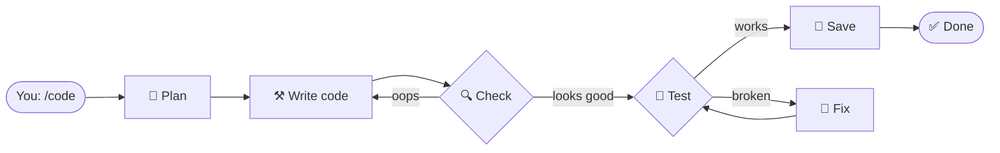

# brainbrew-devkit

**Robots that take turns doing your work.**

You say "go." A team of little robots takes turns. One plans. One writes code. One checks it. One tests it. One saves it. If a robot makes a mistake, another robot fixes it.

You just watch.

## How it works



Each box is a robot. Arrows are how they pass work. If something fails, the chain loops back until it works.

## Try it

**You need:** [Claude Code](https://docs.claude.com/en/docs/claude-code) and Node.js (18+).

**Install** (then restart Claude Code):

```
/plugin marketplace add brainbrewlabs/brainbrew-devkit
/plugin install brainbrew-devkit
```

**Pick a team** — just ask:

```
"Set up a development workflow"
```

**Tell them to start:**

```
/code add a login button
```

That's it. Watch the robots take turns.

## Teams you can pick

| Name | What they do |
|------|--------------|
| **develop** | Plan → code → review → test → save |
| **devops** | Scan → secure → test → deploy |
| **marketing** | Research → write → edit → publish |
| **research** | Gather → analyze → report |
| **docs** | Read code → write docs → review |
| **support** | Sort tickets → answer → review |
| **data** | Collect → clean → chart → report |
| **moderation** | Scan → classify → flag → act |
| **review** | Just review code |
| **skill-dev** | Build new robot skills |
| **minimal** | Empty — bring your own robots |

## Make your own team

Ask:

```
"Create a chain: researcher → writer → editor → publisher"
```

Or write `.claude/chains/my-chain.yaml`:

```yaml
flow:
  researcher:
    routes:
      writer: "Research done"

  writer:
    routes:
      editor: "Draft done"

  editor:
    routes:
      END: "Looks good"
```

Each robot is just a markdown file in `.claude/agents/`. They live with your project.

## Why use it

| Without brainbrew | With brainbrew |
|---|---|
| You tell each robot what to do | Robots pass work themselves |
| You spot the mistakes | Robots catch them |
| You retry when it breaks | Robots retry |
| You glue it all together | YAML does that |

It runs on your Claude Code subscription — no extra bills.

## More

- [Full docs](docs/) — every knob and dial
- [opencode users](docs/guide/installation.md#opencode-support) — works there too, run `/brainbrew-devkit:init` after install
