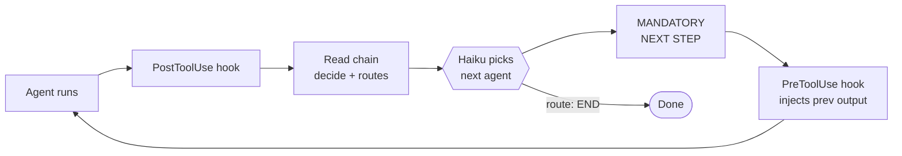

# Introduction

**Self-correcting agent chains for Claude Code.**

A chain of agents takes turns. One plans, one codes, one reviews, one tests, one commits. If an agent fails, another agent fixes it and the chain retries — automatically.

You watch. Approve the PR. Done.

## How it works



That's the whole engine. Each lap of the loop = one agent step.

- **You** define the chain (`flow:` in YAML — agents and their routes).
- **Hooks** fire automatically — no glue code.
- **Haiku** reads the agent's output against the `decide:` prompt and picks the next route.
- **Context** carries forward — previous agent's full output is injected into the next agent's prompt.
- **Failure** is just another route — point it at a `debugger` agent and the chain self-corrects.

## A run, end-to-end

```
/code implement login feature

[Chain runs automatically — you don't touch anything]
→ planner: creates plan
→ plan-reviewer: approves ✓
→ implementer: writes code
→ code-reviewer: 2 issues → auto-routes back to implementer
→ implementer: fixes
→ code-reviewer: passes ✓
→ tester: FAILS → auto-routes to debugger
→ debugger: fixes
→ tester: PASSES ✓
→ git-manager: commits + creates PR

[You only approve the final PR]
```

## Why Brainbrew?

### What it adds to Claude Code

Claude Code has agents and teams. Brainbrew adds the **orchestration layer**:

| | Vanilla Claude Code | With Brainbrew |
|---|---|---|
| **Agent chaining** | Manual (you decide next step) | Automatic (Haiku routing) |
| **Failure recovery** | None (you see error, you fix) | Built-in (debugger → retry) |
| **Quality gates** | None | Haiku QA + auto-retry |
| **Parallel agents** | Teams (manual trigger) | Teams (auto in chain) |
| **Inter-agent state** | None | Memory Bus |

### vs. LangChain / CrewAI

Same orchestration power. Different tradeoffs:

| | Brainbrew | LangChain/CrewAI |
|---|---|---|
| **Config format** | YAML + Markdown | Python code |
| **Cost model** | Your CC subscription | Per-token API billing |
| **Learning curve** | Pick template, start working | Learn framework, write code |
| **Runs inside** | Claude Code | Standalone runtime |

### 9 templates. 60+ agents. Ready to run.

No blank-page problem. Pick a template:

- **develop** — plan → review → implement → parallel(code-quality + security) → test → [fix if fail] → commit
- **devops** — scan → security → test → deploy → monitor → [rollback if alert]
- **marketing** — research → write → edit → SEO → publish → analyze
- **research** — gather → analyze → synthesize → report
- And 5 more (docs, support, data, moderation, review)

### Declared in YAML. Your agents stay with you.

Chain config lives in git. Agents are markdown files in `.claude/agents/`. No vendor lock-in on your components — only the routing engine is brainbrew-specific.

## Features

- **Self-correcting pipelines** — failures auto-route to fixers, then re-enter the chain
- **AI-powered routing** — Haiku analyzes output and picks the next step
- **Agent teams** — parallel execution with coordinated synthesis
- **Quality gates** — `subagent-stop` hook validates output, retries up to 2x
- **Memory Bus** — inter-agent state sharing across pipeline runs
- **Loop detection** — prevents infinite cycles (MAX_AGENT_LOOPS=3)
